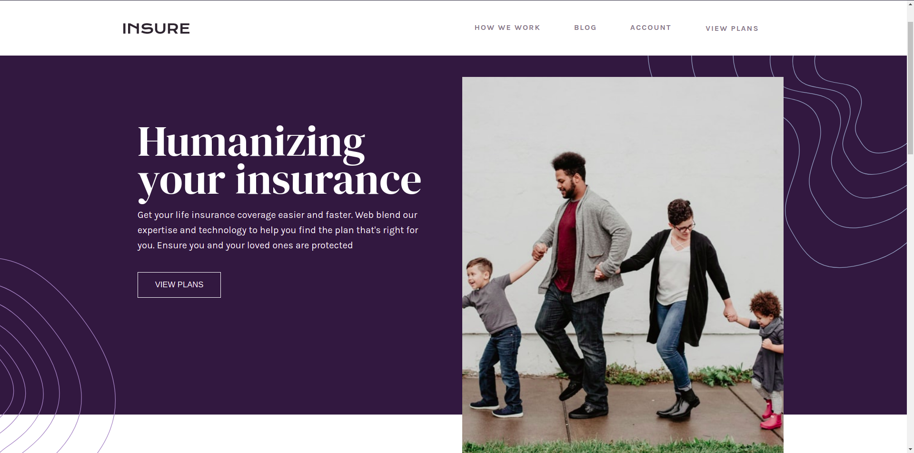

# Frontend Mentor - Insure landing page solution

This is a solution to the [Insure landing page challenge on Frontend Mentor](https://www.frontendmentor.io/challenges/insure-landing-page-uTU68JV8). Frontend Mentor challenges help you improve your coding skills by building realistic projects.

## Overview

### The challenge

Users should be able to:

- View the optimal layout for the site depending on their device's screen size
- See hover states for all interactive elements on the page

### Links

- Solution URL: [repo](hhttps://github.com/AlecANL/insure-lp)
- Live Site URL: [live demo](https://alecanl.github.io/insure-lp/)

### Built with

- Semantic HTML5 markup
- CSS custom properties
- Flexbox
- CSS Grid
- Mobile-first workflow

## Author

- Website - [portfolio](https://alec-portfolio-dev.vercel.app/)
- Frontend Mentor - [@AlecANL](https://www.frontendmentor.io/profile/ALecANL)
- Twitter - [@alexei_alvarez4](https://www.twitter.com/alexei_alvarez4)
